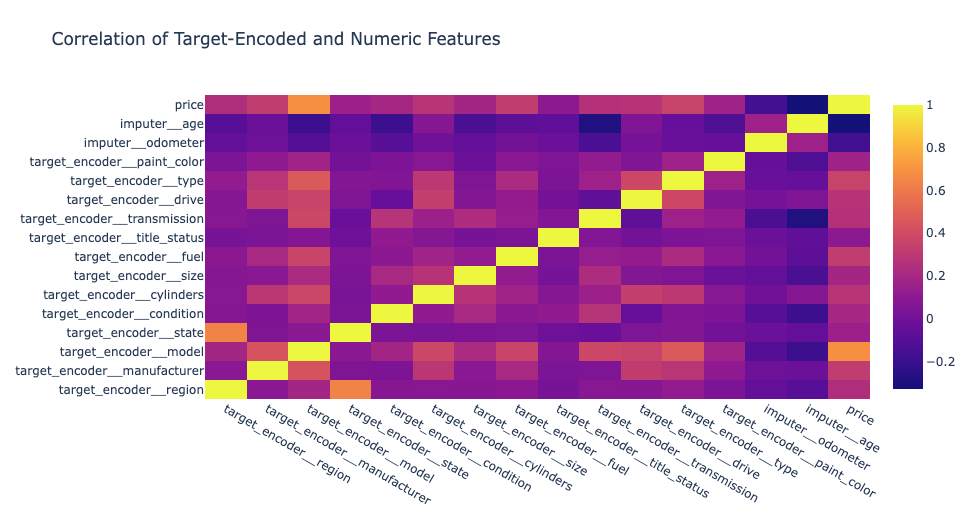
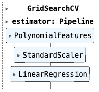
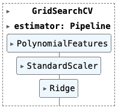
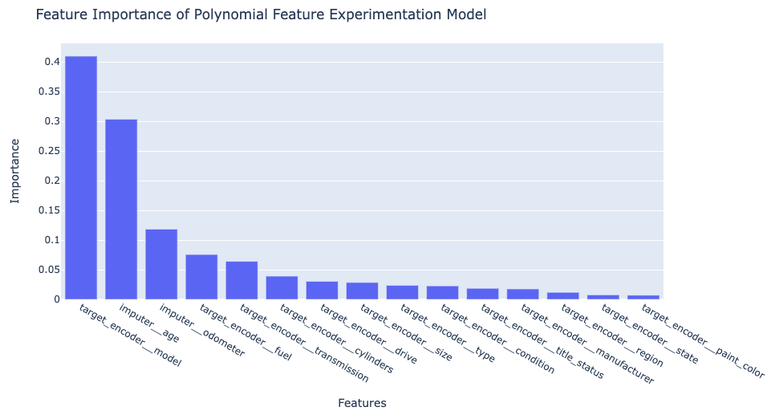
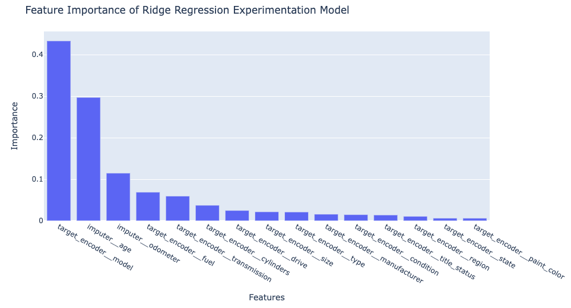

# Used Car Sales
### Zeke Abuhoff

## Business Understanding
After considering the business understanding, we want to get familiar with our data. Write down some steps that you would take to get to know the dataset and identify any quality issues within. Take time to get to know the dataset and explore what information it contains and how this could be used to inform your business understanding.

- I would import the data as a dataframe and examine it to do basic cleaning, such as possibly removing irrelevant features, renaming oddly named features or dropping missing values.

- Then I would produce and visualize a correlation matrix to see what obvious relationships there are between other features and price.

- Then I would experiment with different kinds of models I could make, fitting them to a training subset of the data and evaluating the models' errors on a testing subset.

- Then I would use permutation importance to examine the best model(s) and see how various features rank in importance.

## Data Understanding
_After considering the business understanding, we want to get familiar with our data. Write down some steps that you would take to get to know the dataset and identify any quality issues within. Take time to get to know the dataset and explore what information it contains and how this could be used to inform your business understanding._

- I would import the data as a dataframe and examine it to do basic cleaning, such as possibly removing irrelevant features, renaming oddly named features or dropping missing values.

- Then I would produce and visualize a correlation matrix to see what obvious relationships there are between other features and price.

- Then I would experiment with different kinds of models I could make, fitting them to a training subset of the data and evaluating the models' errors on a testing subset.

- Then I would use permutation importance to examine the best model(s) and see how various features rank in importance.

## Data Preparation
_After our initial exploration and fine tuning of the business understanding, it is time to construct our final dataset prior to modeling. Here, we want to make sure to handle any integrity issues and cleaning, the engineering of new features, any transformations that we believe should happen (scaling, logarithms, normalization, etc.), and general preparation for modeling with sklearn._

I had to transform the data a fair amount to make it easily modeled. This required using a target encoder to make string values into numeric values. There were so many missing values that I didn't want to vastly decrease the size of the dataset by dropping rows with missing data, so instead I used an imputer with a 'mean' strategy to suppose that missing values were average. I allude to this assumption in the report to the client.

## Modeling
_With your (almost?) final dataset in hand, it is now time to build some models. Here, you should build a number of different regression models with the price as the target. In building your models, you should explore different parameters and be sure to cross-validate your findings._

I used GridSearchCV to experiment with polynomial features degrees and ridge regression alphas. The two models that resulted are similar, though this is noteworthy since an alpha value of 10 not improving accuracy suggests that the first model wasn't overfit to begin with.

## Evaluation
_With some modeling accomplished, we aim to reflect on what we identify as a high quality model and what we are able to learn from this. We should review our business objective and explore how well we can provide meaningful insight on drivers of used car prices. Your goal now is to distill your findings and determine whether the earlier phases need revisitation and adjustment or if you have information of value to bring back to your client._

Initially, examining the correlations of individual features to price suggested that model, type and age were the most relevant factors. But, with the possible exception of model, the correlations were not so strong that these features could act as great predictors of price. Thus, I turned to more sophisticated multiple regression modeling.

I used GridSearchCV to create two different models. In one case, I experimented with the degree of polynomial features to find the best linear regression model. In the next, I kept using that degree value and experimented with various alpha values for a ridge regression.

According to mean-squared error, the linear regression model edges out the ridge model, though their performance and feature importances are so similar that one could expect similar results from either. Their scores, both just below 0.73, suggest a reasonably strong ability to predict.

I think this means that there's valuable information here for the client. Either model would be useful for future predictions and the insights described above could, if communicated clearly, help the client understand the market.

## Deployment
_Now that we've settled on our models and findings, it is time to deliver the information to the client. You should organize your work as a basic report that details your primary findings. Keep in mind that your audience is a group of used car dealers interested in fine tuning their inventory._

I know you're all very busy, so I'll make this quick. We've analyzed the car sale data, cleaned it and used it to build machine learning models capable of predicting a car's sale price based on the factors you showed us. Any bozo could tell you that there's a correlation between a car's model and its sale price, but the bozos can't tell you that sale price with 73 percent accuracy, taking into account fifteen different factors. That's what our approach offers.

Our modeling has determined that the car's model, its age and the number on the odometer are the most telling factors. The state you're in? The color of the car? You might think these things matter, but the models tell us those are superficial distractions. Your customers are smart enough to know a quality vehicle by name and they won't be fooled into paying top dollar for old, worn jalopies.

Just keep in mind that our models aren't perfect. For one thing, they're only as good as the data you've provided. To reach these numbers, we had to assume that missing values on the sheet meant the cars in question were average in absent categories. If those values are missing becauseyour salespeople are reluctant to write down the information for junkers, well, then you've thrown off our results, haven't you? Give us good information and these models will sing.

Now what can I do to get you into a machine learning model today?